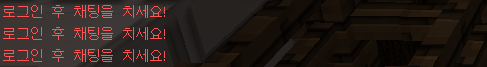

# language

#### [한국어]
- [기능](#기능)

## 기능

```
- /login (로그인 메뉴 창을 엽니다.)
```
```
- 플러그인 파일 안에 있는 User 라는 파일은 로그인 닉, 비번 등을 저장 하기 위에 쓰입니다.
- 서버를 들어오면 자동으로 로그인 메뉴 창이 열립니다.
- 로그인을 하지 않으면 채팅이 제한 됩니다
```


# language

#### [ENGLISH]
- [function](#function)

## function

```
- /login (Opens the login menu window.)
```
```
- A file called User in the plug-in file is used to store login nicknames and passwords.
- When entering the server, the login menu window opens automatically.
- Chat is restricted if you do not log in
```

